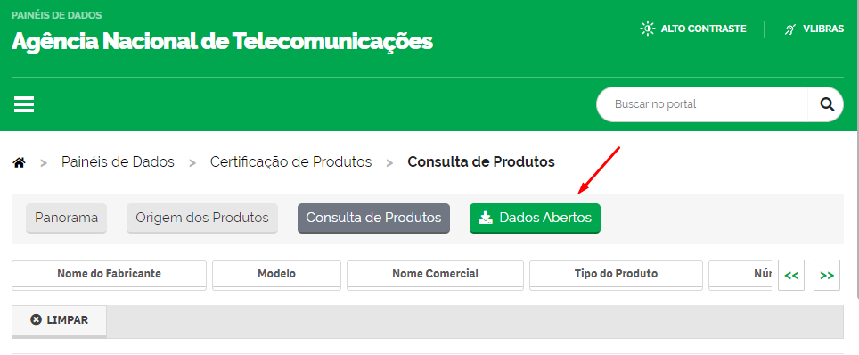
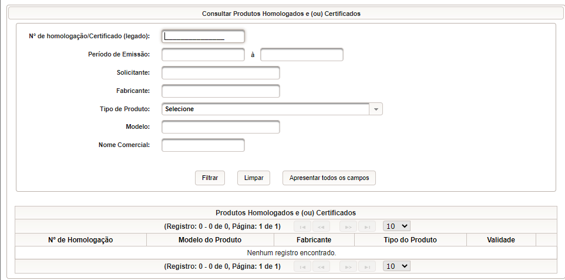

# Pesquisando produtos certificados pela ANATEL

Todos os produtos de telecomunicação em operação no Brasil devem ser homologados pela ANATEL. Uma boa maneira de obter mais informações sobre o funcionamento e muitas vezes fotos internas sem precisar abrir um aparelho, ou compra-lo, é buscar pela sua homologação.

Quando um produto é homologado, ele é dado um número de homologação. Todo produto homologado tem que ter o selo como o da imagem contendo essa informação.

Exemplo de selo de homologação da Anatel (fonte: anatel)

## 1 Consulta de produtos

Se você não possui o número de homologação, ou quer consultar todos os produtos homologados de uma empresa, você pode usar o [portal de Consulta de Produtos](https://www.anatel.gov.br/paineis/certificacao-de-produtos/consulta-de-produtos). No portal você pode pesquisar por qualquer parâmetro ou conjunto de parâmetros para encontrar um produto.

No endereço, você também pode baixar um arquivo `csv` com os dados da sua seleção atual, ou de todos os produtos já homologados pela Anatel.

## Sistema Mosaico

Com o número da certificação encontrado no selo do produto, ou no sistema de consulta da Anatel, você tem pode baixar os documentos de certificação no [sistema mosaico](https://sistemas.anatel.gov.br/mosaico/sch/publicView/listarProdutosHomologados.xhtml). Basta digitar o número de certificação na pesquisa. Você também pode pesquisar por outros itens como no passo anterior, mas o Mosaico é muito lento e costuma dar erros ou não retornar resultados sem motivo aparente.

