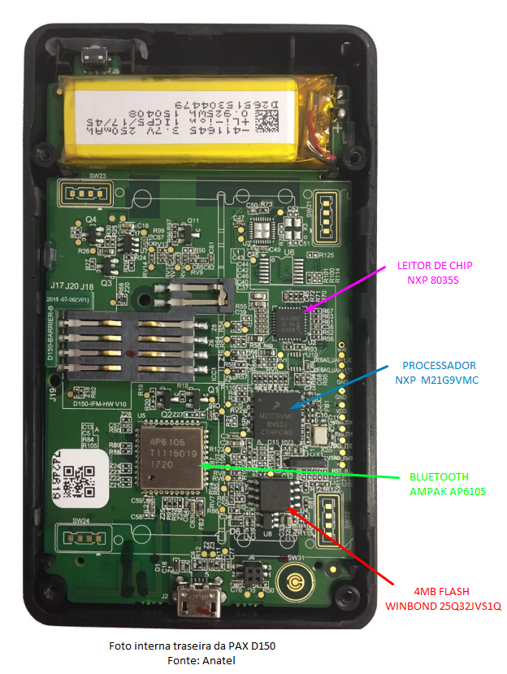

# 1 Dados oficiais

**Modelo:** Pax D150

**Model nº:**  D150-0B0-024-02E0

**ANATEL**: 04823-15-09939

**Alimentação**: 5V DC 300mA

**Produzido por**: CNPJ: 21.785.364/0001-02 

**Descrição**: O D150 é um terminal sem fio, elegante e econômico, certificado pelo PCI PTS 4.x e projetado especificamente para aceitar transações com cartão inteligente EMV. Conecta-se de forma segura via Bluetooth a smartphones e tablets para oferecer uma solução de pagamento móvel perfeita para comerciantes.

## 1.1 Especificações técnicas

| Nome                      | Especificação                                         |
| ------------------------- | ----------------------------------------------------- |
| CPU                       | 32-Bit                                                |
| Memória Interna           | 512 KB Flash, 64 KB SRAM                              |
| Memória Externa           | 4 MB                                                  |
| Tela                      | LCD de 128*32 pixels                                  |
| Teclado                   | 10 Teclas numéricas, 3 teclas de função, 1 de energia |
| Leitor de Cartão com Chip | 1x EMV 4.3                                            |
| Comunicação               | USB, Bluetooth                                        |
| Bateria                   | 3.7V / 250mAh / 0.925Wh, íons de Lítion (Li-ion)      |

## 1.2 Detalhes da Homologação

Inclui fotos internas: **SIM**

| Nº Homologação |  Modelo  |                  Fabricante                  |         Tipo do Produto          |  Validade  | Documentos |
| :------------: | :------: | :------------------------------------------: | :------------------------------: | :--------: | :--------: |
| 04823-15-09939 |   D150   | PAX Computer Technology (Shenzhen) Co., Ltd. | Transceptor de Radiação Restrita | 29/01/2020 |    SIM     |
| 04042-18-09939 |   D150   | PAX Computer Technology (Shenzhen) Co., Ltd. | Transceptor de Radiação Restrita |     -      |    SIM     |
| 00988-19-09939 | D150 Air | PAX Computer Technology (Shenzhen) Co., Ltd. | Transceptor de Radiação Restrita |     -      |    SIM     |


## 1.3 Empresas que adotam a máquina e suas variações de nome

| Empresa      | Nome do Modelo        | Detalhes              | Status        |
| ------------ | --------------------- | --------------------- | ------------- |
| MercadoLivre | Point Mini            | Preta                 | Descontinuada |
| MercadoLivre | Point Mini            | Azul                  | Em produção   |
| PagSeguro    | Minizinha             | Amarela               | Em produção   |
| Payleven     | Payleven Mais         | Branca                | Descontinuada |
| Oruspay      | Gracinha Oruspay      | Preta                 | Em produção   |
| RecargaPay   | Maquininha Recargapay | Preta                 | Em produção   |
| Pagshop      | Maquina Pagshop       | Preta - Skin colorida | Em produção   |
| ServeLoja    | PAX D150              | Preta                 | Em produção   |
| Conta Mobi   | Maquininha Conta Mobi | Preta - Skin colorida | Em produção   |


# 2 Informações Coletadas

## 2.1 Especificações Técnica

| Função         | Modelo                     | Fabricante |
| -------------- | -------------------------- | ---------- |
| Processador    | M21G9VMC - 0N62J - CTBPMBB | NXP        |
| Bluetooth      | AP6105 - B1139007 - 1937   | AMPAK      |
| Leitor de Chip | 8035S - 0402 - ZXD9202     | NXP        |
| Memória 4MB    | 25Q32JVS1Q - 1962          | WINBOND    |

## 2.2 Chips identificados




## 2.3 Mensagens de Erro

### 1. Máquina montada após ativar tamper protection.

```
POS BE ATTACKED
ALL KEYS ARE CLEARED!
```

Ao clicar em `ENTRA`:

```
TAMPER STATUS:040003
Tamper Pin2
```

Clicando novamente em `ENTRA`:

```
CLEAR ATTACK FAIL!
     REBOOT
```

---

### 2. Ligando sem o escudo do chip

Ao ligar aparece rapidamente

```
SELF TEST
```

E então:

```
POS BE ATTACKED
ALL KEYS ARE CLEARED!
```

Ao clicar em `ENTRA`:

```
TAMPER STATUS: 000003
Tamper Acknowledge
```

OU

```
TAMPER STATUS: 060003
Tamper Pin1
```

Clicando novamente em `ENTRA`

```
CLEAR ATTACK FAIL!
     REBOOT
```

Após cerca de um segundo

```
SHUTTING DOWN
```

---

## 2.4 Códigos de 'Tamper Status'

```
TAMPER STATUS: 000003
Tamper Acknowledge
```

```
TAMPER STATUS: 060003
Tamper Pin1
```

```
TAMPER STATUS: 040003
Tamper Pin2
```

